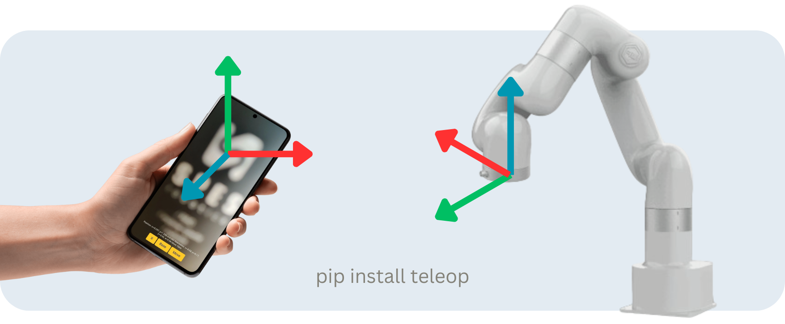

Turns your phone into a robot arm teleoperation device in 3 simple steps:
1. Install and start the server on your computer.
2. Open the URL on your phone.
3. Click `Start` and hold the `Move` button to move the robot arm.

The web application utilizes the WebXR API that fuses the phone's sensors to get the orientation and position of the phone in 3D space. The server receives the phone's pose and sends it to the robot arm controller.


## Installation

The package is available on [PyPI](https://pypi.org/project/teleop/), you can install it using pip.

```bash
pip3 install teleop
```

## Usage

Out of the box, we provide some robot arm interfaces that you can just run, but you can create you own interface by including the [`teleop.Teleop`](./teleop/__init__.py) class in your project.

### Basic Interface

A simple interface that simply prints the teleop response.
You can use it as a reference for creating your own interface.

```bash
python3 -m teleop.basic
```

### ROS 2 Interface

A ROS 2 interface is primarily designed to be compatible with the [cartesian_controllers](https://github.com/fzi-forschungszentrum-informatik/cartesian_controllers) package, but it could also be adapted for [MoveIt Servo](https://moveit.picknik.ai/main/doc/examples/realtime_servo/realtime_servo_tutorial.html) or other packages.

```bash
python3 -m teleop.ros2
```

Published topics:
- `target_frame` ([geometry_msgs/PoseStamped](https://docs.ros2.org/latest/api/geometry_msgs/msg/PoseStamped.html)) : The target pose of the robot arm end effector in the robot base frame.
- `tf` ([tf2_msgs/TFMessage](https://docs.ros2.org/latest/api/tf2_msgs/msg/TFMessage.html)): The transform between the robot base frame and the target frame for visualization.

Subscribed topics:
- `current_pose` ([geometry_msgs/PoseStamped](https://docs.ros2.org/latest/api/geometry_msgs/msg/PoseStamped.html)): The current pose of the robot arm end effector in the robot base frame. Used for updating the reference pose.


You can use the standard ROS 2 arguments to override the default values, for example:
```bash
python3 -m teleop.ros2 --ros-args -r target_frame:=/some_other_topic_name
```

### Custom Interface

For most applications you will need to create a custom interface to interact with your robot arm.

```python
import numpy as np
from teleop import Teleop


def callback(pose: np.ndarray, message: dict) -> None:
    """
    A callback function that will be called when pose updates are received.
    The callback function should take two arguments:
        - np.ndarray: A 4x4 transformation matrix representing the end-effector target pose.
        - dict: A dictionary containing additional information.
    """

    print(f'Pose: {pose}')
    print(f'Message: {message}')


teleop = Teleop()
teleop.subscribe(callback)
teleop.run()
```

## Examples

Check out the examples to see how to use the package in different scenarios:
- [examples/webots](./examples/webots): A teleoperation example of a UR5e robot arm with [ikpy](https://github.com/Phylliade/ikpy) in a [Webots](https://github.com/cyberbotics/webots/) simulator.

## Development

To contribute to the project, you can install the package in editable mode.

```bash
# Install the package in editable mode
git clone https://github.com/SpesRobotics/teleop.git
cd teleop
pip3 install -e .

# Run the tests
python3 -m pytest
```
